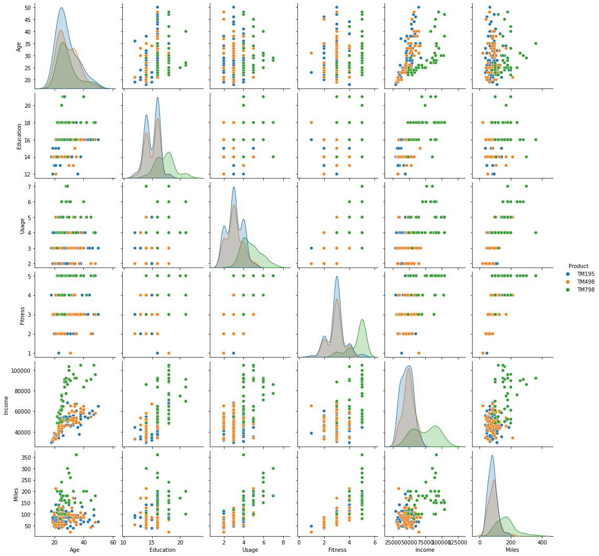
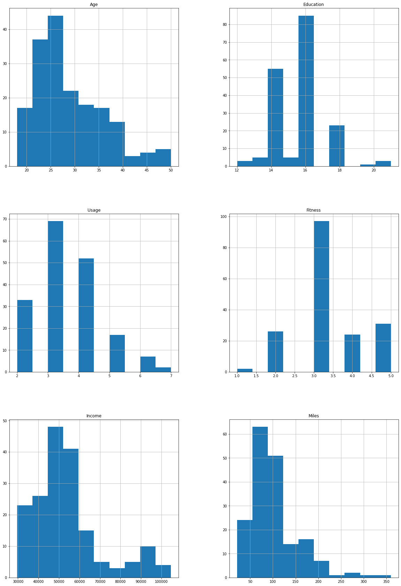

# CardioGoodFitness

## Cardio Good Fitness Project Overview:
* Created a classifier that predicts the cardio machine an individual is likely to buy with an accuracy rate of 80 percent and an f1 score of 0.84
* Downloaded the data from Kaggle: https://www.kaggle.com/saurav9786/cardiogoodfitness
* Used data visulization and exploratory data analysis to come up with a customer profile for each machine 
* Used sklearn's label encoder to encode the target column 
* Implemented 4 machine learning algorithms and evaluated each one of them

## Code and Resources
* Used Google Colab - Pthon 3.6.9
* Packages: numpy, pandas, sklearn, seaborn

## Data Preprocessing
* Checked for missing values
* Gathered the 5 point summary for the dataset by Product

## Data Visualization 
* Visualized the correlation between the variables with a pairplot 

* Created some more histograms to look for correlation

## Data Preperation
* Encoded the target column using the LabelEncoder from sklearn 
* Split the data 

## Implementing Classifiers 
Implemented four classifiers and evaluated their accuracy and f1 scores. The winner by far in both metrics was gradient boosting. 

* Gradient Boosting Accuracy Rate: 0.805
* Gradient Boosting F1 Score: 0.839

## Conclusion:
I found that gradient boosting was the best method to predict which machine a customer was likely to buy with an F1 score of 0.806. The features I decided to base my models on are as follows: annual household income ($); how many times the treadmill was going to be used each week; average number of miles ran/walked each week, the self-rated fitness of the customer; and the age of the customer. 
